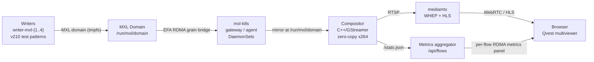

# mxl-dmf-demo-app

A Kubernetes demo for MXL DMF showing zero-copy RDMA transport of uncompressed video flows across nodes, composited live and streamed to a browser multiviewer.

## What it demonstrates

- **Cross-node RDMA/EFA flow mirroring via mxl-k8s** — writer pods produce v210 test-pattern flows to a shared tmpfs domain; the mxl-k8s gateway/agent DaemonSet pair bridges grains across nodes via libmxl-fabrics (EFA provider), making each flow available on the compositor's node without a copy.
- **Zero-copy multi-flow compositing via libmxl** — the C++/GStreamer compositor reads all flows directly from the MXL domain, lays them out in a single GStreamer compositor element, and encodes the mosaic once with x264; there is no per-flow decode pass.
- **Live WebRTC and HLS delivery** — the encoded RTSP stream lands in mediamtx, which serves it to the Qvest-branded multiviewer page via WHEP (WebRTC) with HLS as fallback, rendered in-browser by hls.js.
- **Writer kill-and-recover resilience story** — the metrics aggregator exposes `POST /api/kill/<n>` to delete a writer pod; the per-flow panel shows RDMA metrics (mirror phase, source node, provider, grain delivery) so recovery is visible in real time.

## The 60-second story

Four writer pods (`writer-mxl-{1..4}`) each produce a single uncompressed v210 720p test-pattern flow — smpte, ball, gamut, checkers — to `/run/mxl/domain` on whichever node the scheduler assigns them. When a writer lands on a different node than the compositor, the **mxl-k8s gateway DaemonSet** on the writer's node picks up the new `MxlFlow` CR (via fanotify) and bridges the raw grains across the EFA fabric; the **mxl-k8s agent DaemonSet** on the compositor's node materialises the mirror at `/run/mxl/domain` so it looks local. The intent-shim (`libmxl-intent.so`, injected by an init container) intercepts the first `mxlCreateFlowReader` call and blocks it until the agent signals that the mirror is ready, preventing FLOW_NOT_FOUND races during startup or pod reschedule.

The **C++/GStreamer compositor** (`compositor/`) reads all four flows zero-copy via libmxl, arranges them in a `ceil(sqrt(n))` × `ceil(sqrt(n))` mosaic — a 2 × 2 grid for four flows — composites in I420 space, encodes once with x264, and pushes the result to **mediamtx** over RTSP at `rtsp://mediamtx:8554/composite`.

**mediamtx** re-publishes the composite as a WHEP endpoint (WebRTC) and an HLS playlist. The **Qvest multiviewer** (`k8s/config/index.html`) loads in the browser, tries WebRTC first and falls back to hls.js if the WHEP handshake fails. A side panel shows live RDMA metrics fetched from `GET /api/flows`, served by the **metrics aggregator** (`k8s/metrics/aggregator.py`), which merges compositor stats with Kubernetes pod data and MxlReceiver/MxlFlowMirror CRs.

## Architecture

## Repository layout

| Path | Contents |
|------|----------|
| `compositor/` | C++/GStreamer compositor source and vendored mxl headers; built by a separate CI workflow (`build-compositor.yml`) and pushed to GHCR. |
| `k8s/` | **The deliverable** — all Kubernetes manifests (`writer-deployment.yaml`, `composite-deployment.yaml`, `mediamtx-*.yaml`, etc.), `config/` (mediamtx config, Caddyfile, `index.html` served by the Caddy sidecar), and `metrics/` (the Python metrics aggregator). Rendered by kustomize and pushed as an OCI artifact on every CI run. |
| `.github/` | CI: `build.yml` pushes the rendered `k8s/` tree as a Flux OCI artifact; `build-compositor.yml` builds and pushes the compositor image; release-please manages the RC version series. |

## Deploying

There is no local `docker compose` or `kubectl apply -f .` path — the cluster pulls everything from CI artifacts. On every push to `main` (or a version tag), the `Push manifests` workflow renders `k8s/` with kustomize and pushes it as an OCI artifact (`ghcr.io/qvest-digital/mxl-dmf-demo-app-manifests`) that Flux reconciles onto the cluster. The compositor image is built and pushed separately. See [docs/operations.md](docs/operations.md) for cluster access, namespace layout, and day-two procedures.

## Documentation

- [docs/architecture.md](docs/architecture.md) — deep-dive into the MXL domain, mxl-k8s control plane, compositor pipeline, and mediamtx integration.
- [docs/operations.md](docs/operations.md) — deploying, monitoring, and debugging on the cluster; kill-and-recover walkthrough.
- [docs/ci-and-release.md](docs/ci-and-release.md) — CI pipeline structure, OCI artifact tagging, PR environments, and the release-please RC workflow.

## Versioning

Releases follow a `1.0.0-rc.N` pre-release series managed by release-please (conventional commits → semver, prerelease type `rc`). See [CHANGELOG.md](CHANGELOG.md) for the full history and the [GitHub releases page](https://github.com/qvest-digital/mxl-dmf-demo-app/releases) for tagged artifacts.
